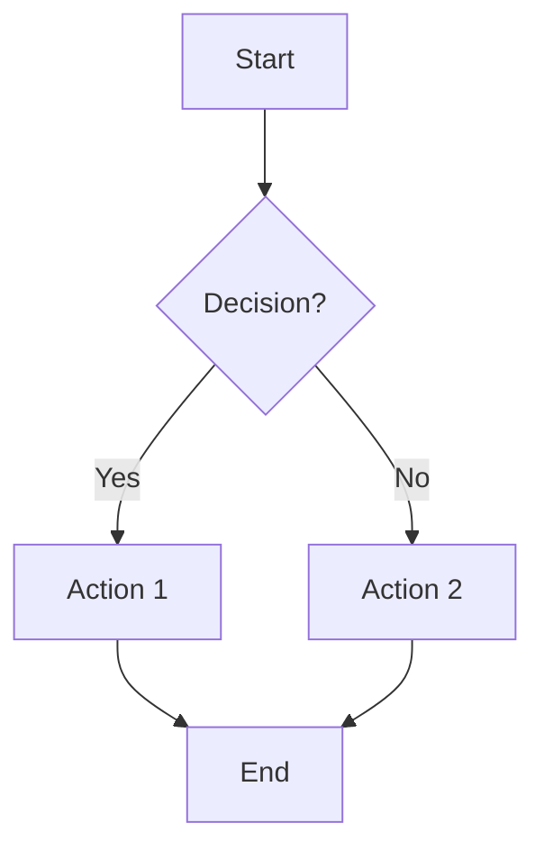
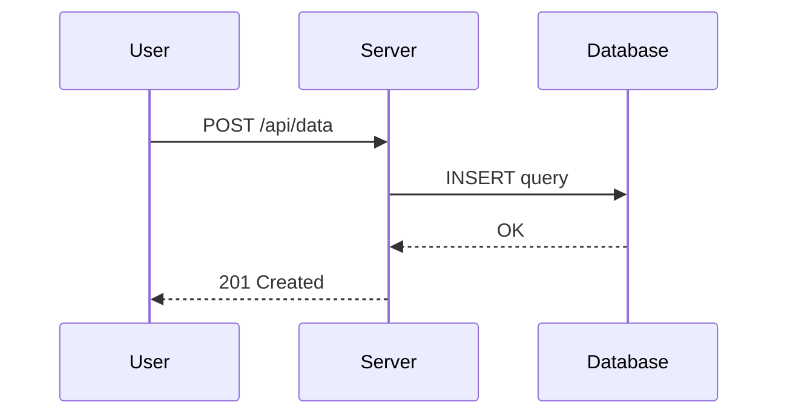
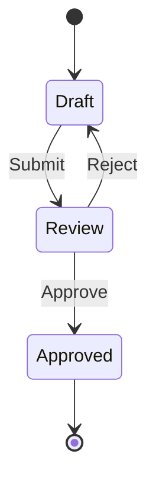

# Visual Content Format Specifications

Detailed format specs for each TriliumNext visual content type. Read the relevant section before generating content.

---

## 1. Mermaid Format

**ETAPI type**: `mermaid`
**MIME**: `text/vnd.mermaid` (auto-detected)
**Content**: Raw Mermaid syntax as plain text

### Supported Diagram Types

flowchart, sequence, class, state, gantt, pie, mindmap, timeline, ER, journey, quadrant, sankey, block, packet

### Syntax Rules

- Use `[Step 1: Text]` not `[1. Text]` (numbered lists conflict with Mermaid parser)
- Subgraph naming: `subgraph id["Display Name"]`
- Special characters inside nodes: use `&#34;` for quotes, `&#40;` / `&#41;` for parens, or wrap in backticks
- Line breaks within nodes: use `<br>` (not `\n` — Mermaid renders `\n` as literal text)
- Arrow types: `-->` solid, `-.->` dashed, `==>` thick, `--text-->` labeled
- Keep node IDs short alphanumeric (e.g., `A`, `B1`, `svc1`)
- For large diagrams, use subgraphs to organize logically

### Examples

**Flowchart:**


**Sequence:**


**State:**


---

## 2. Canvas / Excalidraw Format

**ETAPI type**: `canvas`
**MIME**: `application/json` (auto-detected)
**Content**: Excalidraw JSON

### JSON Structure

```json
{
  "type": "excalidraw",
  "version": 2,
  "elements": [],
  "appState": {
    "viewBackgroundColor": "#ffffff"
  },
  "files": {}
}
```

### Element Types

`rectangle`, `ellipse`, `diamond`, `text`, `arrow`, `line`, `freedraw`

### Required Element Properties

Every element must have:

| Property | Type | Notes |
|----------|------|-------|
| `id` | string | Unique identifier (use 8+ char random alphanumeric) |
| `type` | string | Element type from list above |
| `x` | number | X coordinate |
| `y` | number | Y coordinate |
| `width` | number | Element width |
| `height` | number | Element height |
| `strokeColor` | string | Border/stroke color hex |
| `backgroundColor` | string | Fill color hex or `"transparent"` |
| `fillStyle` | string | `"solid"`, `"hachure"`, or `"cross-hatch"` |
| `strokeWidth` | number | 1-4 typically |
| `roughness` | number | 0 = sharp, 1 = slightly rough, 2 = hand-drawn |
| `opacity` | number | 0-100 |
| `angle` | number | Rotation in radians (usually 0) |
| `seed` | number | Random integer for roughness rendering |
| `version` | number | Start at 1 |
| `versionNonce` | number | Random integer |
| `isDeleted` | boolean | Always `false` |
| `groupIds` | array | Empty `[]` unless grouping |
| `boundElements` | array/null | References to bound elements |
| `updated` | number | Timestamp ms |
| `link` | null | Usually `null` |

### Text Elements — Additional Properties

| Property | Type | Notes |
|----------|------|-------|
| `text` | string | Display text |
| `fontSize` | number | 24-28 for titles, 14-16 for body |
| `fontFamily` | number | 1 = Virgil (hand), 2 = Helvetica, 3 = Cascadia, 5 = handwritten |
| `textAlign` | string | `"left"`, `"center"`, `"right"` |
| `verticalAlign` | string | `"top"`, `"middle"` |
| `lineHeight` | number | 1.25 default |
| `baseline` | number | Usually fontSize * 0.8 |

### Arrow Elements — Additional Properties

| Property | Type | Notes |
|----------|------|-------|
| `startBinding` | object/null | `{"elementId": "id", "focus": 0, "gap": 8}` |
| `endBinding` | object/null | `{"elementId": "id", "focus": 0, "gap": 8}` |
| `points` | array | `[[0, 0], [dx, dy]]` relative to arrow origin |

### Design Rules

- **Canvas bounds**: Keep elements within 0-1200 x 0-800 coordinate range
- **Spacing**: Minimum 40px between elements, 80px between groups
- **Colors**:
  - Title text: deep blue `#1e40af`
  - Connectors/arrows: bright blue `#3b82f6`
  - Body text: dark gray `#374151`
  - Emphasis: amber `#f59e0b`
  - Backgrounds: light shades like `#dbeafe`, `#fef3c7`, `#dcfce7`
- **Font sizes**: 24-28px titles, 14-16px body
- Use `fontFamily: 5` for handwritten feel, `fontFamily: 2` for clean look
- Use `roughness: 1` for a natural hand-drawn aesthetic

### Minimal Example

```json
{
  "type": "excalidraw",
  "version": 2,
  "elements": [
    {
      "id": "rect1",
      "type": "rectangle",
      "x": 100,
      "y": 100,
      "width": 200,
      "height": 80,
      "strokeColor": "#1e40af",
      "backgroundColor": "#dbeafe",
      "fillStyle": "solid",
      "strokeWidth": 2,
      "roughness": 1,
      "opacity": 100,
      "angle": 0,
      "seed": 12345,
      "version": 1,
      "versionNonce": 67890,
      "isDeleted": false,
      "groupIds": [],
      "boundElements": [{"id": "text1", "type": "text"}],
      "updated": 1700000000000,
      "link": null
    },
    {
      "id": "text1",
      "type": "text",
      "x": 130,
      "y": 125,
      "width": 140,
      "height": 30,
      "text": "Service A",
      "fontSize": 20,
      "fontFamily": 5,
      "textAlign": "center",
      "verticalAlign": "middle",
      "lineHeight": 1.25,
      "baseline": 16,
      "strokeColor": "#1e40af",
      "backgroundColor": "transparent",
      "fillStyle": "solid",
      "strokeWidth": 1,
      "roughness": 0,
      "opacity": 100,
      "angle": 0,
      "seed": 11111,
      "version": 1,
      "versionNonce": 22222,
      "isDeleted": false,
      "groupIds": [],
      "boundElements": null,
      "updated": 1700000000000,
      "link": null,
      "containerId": "rect1"
    }
  ],
  "appState": {
    "viewBackgroundColor": "#ffffff"
  },
  "files": {}
}
```

---

## 3. Mind Map Format (MindElixir JSON)

**ETAPI type**: `mindMap`
**MIME**: `application/json` (auto-detected)
**Content**: MindElixir JSON

### JSON Structure

```json
{
  "nodeData": {
    "id": "root",
    "topic": "Central Idea",
    "children": [
      {
        "id": "child1",
        "topic": "Branch 1",
        "direction": 1,
        "children": []
      }
    ]
  }
}
```

### Node Properties

| Property | Required | Type | Notes |
|----------|----------|------|-------|
| `id` | Yes | string | Unique (e.g., `"root"`, `"b1"`, `"b1c1"`) |
| `topic` | Yes | string | Display text, max 25 characters |
| `children` | Yes | array | Child nodes, use `[]` for leaf nodes |
| `direction` | No | number | `0` = left, `1` = right (root children only) |
| `style` | No | object | `{"color": "#hex", "background": "#hex", "fontSize": "16px"}` |

### Constraints (Miller's Rule)

- **5-7 children** per node (never exceed 9)
- **3-4 depth levels** maximum
- **20-40 total nodes** for readability
- **5-6 distinct colors** maximum
- Topic text: max 25 characters (abbreviate if needed)

### Layout Guidelines

- **Default**: Left-sided layout (all children `direction: 1` or omitted)
- **Bilateral**: Use for comparisons — `direction: 0` for left branches, `direction: 1` for right branches
- Alternate directions on root children for visual balance in bilateral layout

### Color Palette

Use consistent colors per branch level:
- Level 1 (root children): `#2196F3` blue, `#4CAF50` green, `#FF9800` orange, `#9C27B0` purple, `#F44336` red
- Level 2+: Lighter shades of the parent branch color
- Root: Use default styling (no custom style)

### Example

```json
{
  "nodeData": {
    "id": "root",
    "topic": "Web Architecture",
    "children": [
      {
        "id": "b1",
        "topic": "Frontend",
        "direction": 1,
        "style": {"background": "#2196F3", "color": "#fff"},
        "children": [
          {"id": "b1c1", "topic": "Angular", "children": []},
          {"id": "b1c2", "topic": "React", "children": []},
          {"id": "b1c3", "topic": "Vue", "children": []}
        ]
      },
      {
        "id": "b2",
        "topic": "Backend",
        "direction": 0,
        "style": {"background": "#4CAF50", "color": "#fff"},
        "children": [
          {"id": "b2c1", "topic": "Node.js", "children": []},
          {"id": "b2c2", "topic": "Python", "children": []},
          {"id": "b2c3", "topic": "Go", "children": []}
        ]
      },
      {
        "id": "b3",
        "topic": "Infrastructure",
        "direction": 1,
        "style": {"background": "#FF9800", "color": "#fff"},
        "children": [
          {"id": "b3c1", "topic": "AWS", "children": []},
          {"id": "b3c2", "topic": "Docker", "children": []},
          {"id": "b3c3", "topic": "Kubernetes", "children": []}
        ]
      }
    ]
  }
}
```

---

## 4. Relation Map (Composite Type)

**ETAPI type**: `relationMap`
**Content**: Empty string `""` (entities are child notes, not content)

Relation Maps are **not a single content format** — they're a composite workflow:

### Workflow

1. **Create the `relationMap` container note** via `create-with-clone`
2. **Create child `text` notes** for each entity (using the legacy `create` command with `--parent` set to the container's noteId)
3. **Create relation attributes** between child notes via `add-relation`
4. Optionally add `#displayRelations` label on the container to filter which relation names are visible

### Step-by-Step

```bash
# 1. Create container
RESULT=$(python3 <skill>/scripts/trilium_api.py create-with-clone \
  --config <skill>/references/config.json --domain engineering --category architecture \
  --title "System Dependencies" --content "" --type relationMap --note-type research)
CONTAINER_ID=$(echo "$RESULT" | python3 -c "import sys,json; print(json.load(sys.stdin)['noteId'])")

# 2. Create entity notes under the container
ENTITY_A=$(python3 <skill>/scripts/trilium_api.py create \
  --config <skill>/references/config.json --parent "$CONTAINER_ID" \
  --title "Auth Service" --content "<p>Handles authentication</p>" --type text)
# ... repeat for each entity

# 3. Add relations
python3 <skill>/scripts/trilium_api.py add-relation \
  --config <skill>/references/config.json \
  --source-id "$AUTH_ID" --name "dependsOn" --target-id "$DB_ID"
```

### Notes

- The container note renders as a visual graph — entities are boxes, relations are edges
- Entity positions are auto-calculated by Trilium; no coordinate system needed
- Relation names become edge labels
- Keep entity count under 15 for readability
- Use meaningful relation names: `dependsOn`, `uses`, `extends`, `calls`, `owns`

---

## 5. Geo Map (Composite — Collection View)

**ETAPI type**: `book` (container) with `#viewType=geoMap` label
**Content**: N/A — pins come from child notes with `#geolocation` labels

Geo Maps are a **Collection view** (since TriliumNext v0.97.0).

### Workflow

1. **Create a `book` container note** via `create-with-clone`
2. **Add `#viewType=geoMap` label** to the container
3. **Create child notes** with `#geolocation="lat,lng"` labels — each becomes a map pin
4. Optionally add `#color` label on child notes for marker colors
5. Optionally add `#map:style` label on the container for tile theme

### Step-by-Step

```bash
# 1. Create container
RESULT=$(python3 <skill>/scripts/trilium_api.py create-with-clone \
  --config <skill>/references/config.json --domain daily_life --category travel \
  --title "Places Visited 2026" --content "" --type book --note-type research)
CONTAINER_ID=$(echo "$RESULT" | python3 -c "import sys,json; print(json.load(sys.stdin)['noteId'])")

# 2. Add viewType label (via add-label — requires the skill's client.py add_label)
# This may need to be done via the ETAPI attributes endpoint directly

# 3. Create child location notes
python3 <skill>/scripts/trilium_api.py create \
  --config <skill>/references/config.json --parent "$CONTAINER_ID" \
  --title "Sydney Opera House" \
  --content "<p>Iconic performing arts centre</p>" \
  --type text \
  --labels "geolocation=-33.8568,151.2153,color=#3b82f6"
```

### Geolocation Format

- Format: `"latitude,longitude"` (decimal degrees)
- Example: `"40.7128,-74.0060"` for New York City
- Example: `"-33.8688,151.2093"` for Sydney

### Marker Colors

Use `#color` label values: `#3b82f6` (blue), `#ef4444` (red), `#22c55e` (green), `#f59e0b` (amber), `#8b5cf6` (purple)

### Limitations

- The `#viewType=geoMap` label may need to be verified on the user's TriliumNext version
- GPX track files can be added as child file notes for route visualization
- Map position and zoom are persisted by Trilium on user interaction
